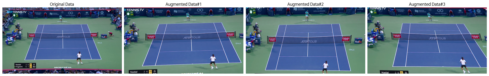

Hawk-Eye
==

# Objectives
1. Detect tennis court edges.
2. Detect tennis ball and bounces.
3. (_Ongoing_) Estimate tennis player poses.

# Datasets
- [yastrebksv's dataset](https://github.com/yastrebksv/TennisCourtDetector) for court edge detection.
- [TrackNet](https://arxiv.org/abs/1907.03698) dataset for ball and bounce detection.

# Methods
- **Stacked Hourglass Network** for court and ball detection.
  - Use **focal loss** for heatmap training. (Reference: _Object as Points_, arXiv 2019.)
  - Perform data augmentation to enhance robustness against varying camera angles.
  
- **Catboost** for ball bounce detection.

# Usage
- Requirements
  - catboost
  - torch
  - albumentations

- Scripts
```bash
COURT_DATA="./Datasets/TennisCourtDetector/"
BALL_DATA="./Datasets/TrackNet/"

# Train court detection model
python main.py --mode 'train' --device 'cuda:0' --task 'court' --save_root './model-store/court/' --data_path ${COURT_DATA} --num_class 14 --epoch 100 --lr_milestone 90 --imsize 576 1024 --aug_policy 1

# Train ball detection model
python main.py --mode 'train' --device 'cuda:1' --task 'ball' --num_class 1 --num_seq 1 --save_root './model-store/ball/' --data_path ${BALL_DATA}  --epoch 100 --lr_milestone 90 --imsize 576 1024 --aug_policy 1

# Train bounce detection model
python main.py --mode 'train' --device 'cpu' --task 'bounce' --num_seq 3 --data_path ${BALL_DATA} --save_root './model-store/bounce/'

# Video demo
python demo.py --court_model_path './model-store/court/weights/ckpt.pth' --ball_model_path './model-store/ball//weights/ckpt.pth' --bounce_model_path './model-store/bounce/weights/ckpt.cbm' --video_path './sample.mp4'
```


# Result
Recall and Precision (w/ score threshold: 0.5, distance threshold 7 pixels)

| Model | Recall | Precision | TP | FP | TN | FN |
| --- | --- | --- | --- | --- | --- | --- |
| Court | 0.9620 | 0.9997 | 29662 | 8 | 111 | 1173 |
| Ball | 0.9216 | 0.9984 | 4372 | 7 | 208 | 372 |
| Bounce | 0.6794 | 0.7607 | 89 | 28 | 4484 | 42 |

Demo video


# Todo
- [x] Court edge detection
- [x] Ball detection and bounce detection
- [ ] Player pose estimation
- [ ] Match summary (e.g., ball speed, ...)
- [ ] Improve the court edge detection algorithm
  - [ ] Utilize more recent keypoint detection models
    - [ ] _Deep High-Resolution Representation Learning for Human Pose Estimation_, 2019 CVPR
    - [ ] _Sapiens: Foundation for Human Vision Models_, 2024 ECCV
  - [ ] Enhance the post-processing algorithm
    - [ ] Improve an image processing-based edge detection algorithm
- [ ] Improve the ball detection algorithm
- [ ] Improve the bounce detection algorithm
- [ ] Develop a unified model for court, ball detection, and human pose estimation

# Reference
- TrackNet: A Deep Learning Network for Tracking High-speed and Tiny Objects in Sports Applications [2019, arXiv](https://arxiv.org/pdf/1907.03698)
- https://github.com/yastrebksv/TennisProject